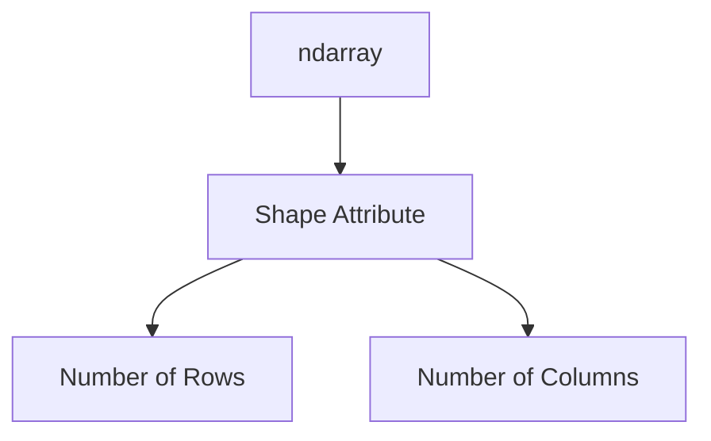
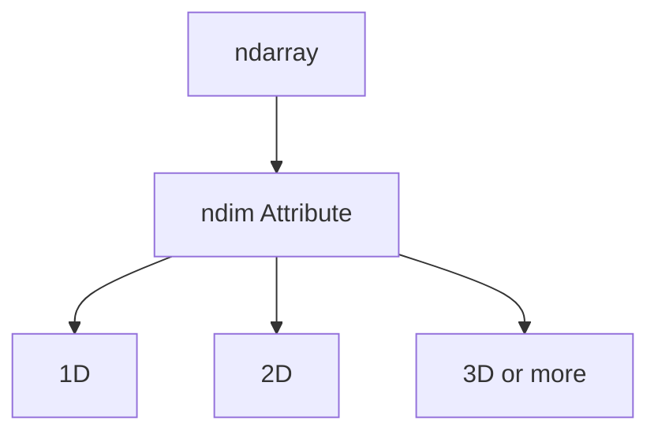
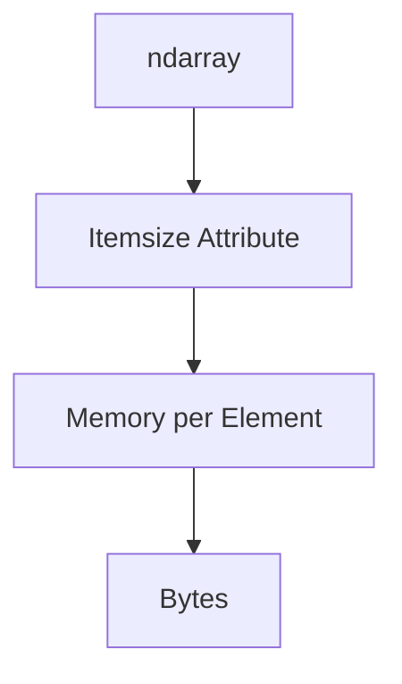
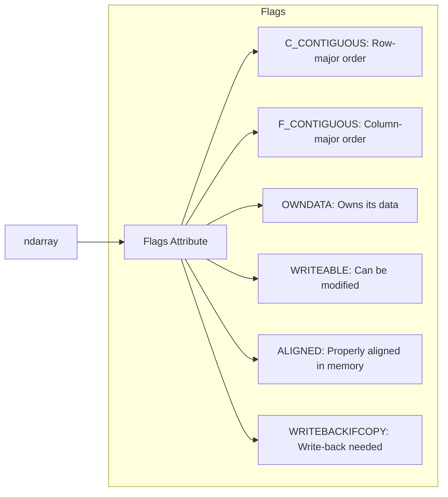

### 1. NUMPY − ARRAY ATTRIBUTES

#### 1.1. ndarray.shape

**shape** attribute என்பது NumPy array-இன் அமைப்பை (structure) குறிக்கிறது. இது array-இல் எத்தனை rows மற்றும் columns உள்ளன என்பதை சொல்கிறது. 

எந்த ஒரு array-யும் கையாளும்போது, அதன் **shape** attribute மூலம் array-இன் பரிமாணங்களை (dimensions) அறிந்து கொள்ளலாம். **shape** attribute-ல் உள்ள  values array-இல் உள்ள rows மற்றும் columns எண்ணிக்கையை தருகின்றன.

```python
import numpy as np

arr = np.array([[1, 2, 3], [4, 5, 6]])
print("Shape of array:", arr.shape)
```

மேலே கொடுக்கப்பட்டுள்ள code-இல், **arr** என்ற 2D array உருவாக்கப்பட்டுள்ளது. இந்த array-இன் **shape** attribute-ஐ பயன்படுத்தி array-இன் அமைப்பை அறியலாம்.




அதாவது, இதன் **output:**

```
Shape of array: (2, 3)
```

இந்த array-இல் 2 rows மற்றும் 3 columns உள்ளன என்று பொருள். 

இதன் மூலம், **shape** attribute ஒரு Numpy array-இன் கட்டமைப்பை (structure) முழுமையாக குறிக்க உதவுகிறது.

#### 1.2. ndarray.ndim

**ndim** என்பது array-இன் பரிமாணங்களின் எண்ணிக்கையை (number of dimensions) குறிக்கிறது. NumPy array-களின் பரிமாணங்களை புரிந்து கொள்ள இது மிகவும் முக்கியமான attribute ஆகும்.

ஒரு array எத்தனை dimension-களை கொண்டுள்ளது என்பதை **ndim** attribute-ஐ பயன்படுத்தி எளிதில் அறிய முடியும். இதன் உதவியால், 1D, 2D அல்லது multi-dimensional array என்பதை நம்மால் அறிய முடியும்.

```python
import numpy as np

arr = np.array([[1, 2, 3], [4, 5, 6]])
print("Number of dimensions:", arr.ndim)
```

மேலே கொடுக்கப்பட்டுள்ள code-இல், **arr** என்ற 2D array உருவாக்கப்பட்டுள்ளது. இந்த array-இன் **ndim** attribute-ஐ பயன்படுத்தி array-இன் பரிமாணங்களின் எண்ணிக்கையை (number of dimensions) அறியலாம்.




**Output:**

```
Number of dimensions: 2
```

**2** என்று வரும்போது, இந்த array ஒரு 2D array என்று பொருள். 

இதன் மூலம், **ndim** attribute ஒரு Numpy array-இன் பரிமாணங்களின் எண்ணிக்கையை முழுமையாக அறிய உதவுகிறது.

#### 1.3. numpy.itemsize

**itemsize** attribute ஒரு element-ஐ represent செய்ய memory-யில் எத்தனை bytes எடுக்கின்றது என்பதை அளிக்கிறது. இது, NumPy array-ல் உள்ள ஒவ்வொரு element-க்கும் memory allocation-ஐ எவ்வளவு எடுக்கும் என்பதை அறிய உதவுகிறது.

```python
import numpy as np

arr = np.array([1, 2, 3, 4, 5])
print("Item size of array:", arr.itemsize, "bytes")
```

இந்த code-இல், **arr** என்ற 1D array உருவாக்கப்பட்டுள்ளது, மற்றும் **itemsize** attribute-ஐ பயன்படுத்தி array-இன் ஒவ்வொரு element-ஐ memory-யில் represent செய்ய எவ்வளவு bytes எடுக்கின்றது என்பதை பார்க்கலாம்.




**Output:**

```
Item size of array: 8 bytes
```

**8 bytes** என்று வரும்போது, அந்த array-இல் உள்ள ஒவ்வொரு element-மும் 8 bytes அளவு memory-யைப் பயன்படுத்துகின்றது என்று பொருள்.

இதன் மூலம், **itemsize** attribute ஒரு Numpy array-இல் உள்ள ஒவ்வொரு element-இன் memory அளவை சரியாக அளக்க உதவுகிறது.

#### 1.4. numpy.flags

**flags** attribute என்பது NumPy array-இன் memory layout-ஐ குறிக்கிறது. இது array-இன் உள்ளமைப்புகள் (properties) மற்றும் memory-இன் அடிப்படையில் array எவ்வாறு அமைக்கப்பட்டுள்ளது என்பதை விளக்குகிறது.

```python
import numpy as np

arr = np.array([1, 2, 3, 4, 5])
print("Flags of the array:\n", arr.flags)
```

இந்த code-இல், **arr** என்ற 1D array உருவாக்கப்பட்டுள்ளது, மற்றும் **flags** attribute-ஐ பயன்படுத்தி array-இன் memory layout பற்றிய தகவல்களை அறியலாம்.



**Output:**

```
Flags of the array:
  C_CONTIGUOUS : True
  F_CONTIGUOUS : False
  OWNDATA : True
  WRITEABLE : True
  ALIGNED : True
  WRITEBACKIFCOPY : False
```

இந்த **flags** attribute இவ்வாறு array-இன் memory layout பற்றிய விவரங்களை கொடுக்கிறது:

- **C_CONTIGUOUS**: Array-இன் memory layout C-style (row-major) ஆக உள்ளது.
- **F_CONTIGUOUS**: Array-இன் memory layout Fortran-style (column-major) ஆக இல்லை.
- **OWNDATA**: Array-க்கு சொந்தமாக memory data இருக்கிறது.
- **WRITEABLE**: Array-இல் உள்ள data மாற்றக்கூடியது.
- **ALIGNED**: Data memory alignment சரியாக உள்ளது.
- **WRITEBACKIFCOPY**: Write-back operation தேவைப்படும்போது False ஆகும்.

இதன் மூலம், **flags** attribute NumPy array-இன் memory layout மற்றும் array-இன் உள்ளமைப்புகள் பற்றிய முழு தகவல்களை வழங்குகிறது.

<div style="page-break-after: always;"></div>

