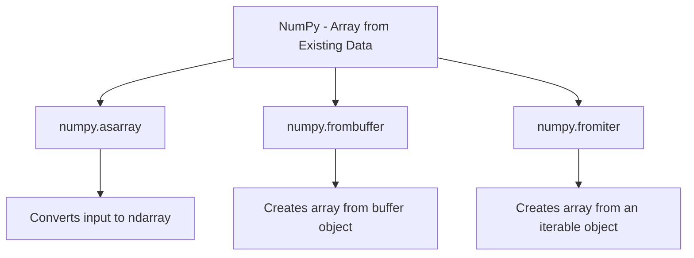

### 3. NUMPY − ARRAY FROM EXISTING DATA

Numpy-ல் array-களை உருவாக்குவதற்கான முக்கியமான வழிகளில் ஒன்றாக **Existing data**-விலிருந்து array-ஐ உருவாக்குவது அமைகிறது. இது Python-ல் ஏற்கனவே இருக்கும் data structures, போன்றவை (lists, buffers, iterables) கொண்டு நமக்கு தேவையான array-களை எளிதாக உருவாக்க உதவுகிறது. இதனால் data-ஐ NumPy-யின் powerful array operations-இல் பயன்படுத்த முடியும்.




#### 3.1. numpy.asarray

**asarray()** function-ஐ பயன்படுத்தி, ஒரு existing data-ஐ NumPy array-ஆக மாற்றலாம். இதன் முக்கிய பயனாக, இதனால் original data-ஐ clone செய்து, array-ஆக மாற்றுவதில் பயன்படுத்தப்படும் memory space குறைவாக இருக்கும்.

```python
import numpy as np

# list data-யை numpy array-ஆக மாற்றுதல்
list_data = [1, 2, 3, 4, 5]
array_data = np.asarray(list_data)
print("Array from list:", array_data)
```

**Output:**

```
Array from list: [1 2 3 4 5]
```

இந்த Code-இல், ஒரு Python list **list_data**-ஐ **asarray()** function-ஐ பயன்படுத்தி NumPy array-ஆக மாற்றுகிறோம். இதன் மூலம், original data type retain ஆகிறது (சேமித்து),  list_data array-ஆக மாற்றப்படுகிறது, மேலும் நம்மால் memory usage-யை திறமையாக கையாள முடிகிறது.

#### 3.2. numpy.frombuffer

**frombuffer()** method-ஐ பயன்படுத்தி, buffer-ல் உள்ள data-ஐ NumPy array-ஆக மாற்ற முடியும். buffer-ல் உள்ள binary data-ஐ NumPy array-இல் மாற்றுவதன் மூலம், அதனுடன் அடுத்தடுத்த data manipulations மேற்கொள்ள உதவுகிறது.

```python
buffer = b'Hello World'
array_buffer = np.frombuffer(buffer, dtype='S1')
print("Array from buffer:", array_buffer)
```

**Output:**

```
Array from buffer: [b'H' b'e' b'l' b'l' b'o' b' ' b'W' b'o' b'r' b'l' b'd']
```

இங்கு, **buffer** என்ற binary data-ஐ **frombuffer()** method மூலம் NumPy array-ஆக மாற்றுகிறோம். இதனால், byte data அலகு அலகாக array-இல் element-களாகக் கிடைக்கிறது. இதுபோன்ற conversions binary data parsing மற்றும் manipulation-ஐ எளிதாக்கும்.

#### 3.3. numpy.fromiter

**fromiter()** function-ஐ பயன்படுத்தி, iterable object-களை NumPy array-ஆக மாற்ற முடியும். இது memory-efficient-ஆகவும், high-performance data conversion-ஐ உருவாக்கவும் உதவுகிறது. **fromiter()** iterable values-ஐ array-ஆக dynamic-ஆக மாற்றுவதற்கான ஒரு method ஆகும். Iterables-ல் இருந்து continuous data stream-ஐ NumPy array-ஆக உருவாக்குவதன் மூலம், sequence-களை நேரடியாக array-களாக மாற்ற முடியும். 

```python
iterable = (x*x for x in range(5))
array_iter = np.fromiter(iterable, dtype='int32')
print("Array from iterable:", array_iter)
```

**Output:**

```
Array from iterable: [ 0  1  4  9 16]
```

இந்த Code-இல், **iterable** என்ற generator expression-ஐ **fromiter()** method மூலம் NumPy array-ஆக மாற்றுகிறோம். இதனால் iterator-ல் உள்ள data sequential order-ஆக array-இல் சேமிக்கப்படுகிறது.

**குறிப்புகள்:**

- **asarray()** function data-ஐ NumPy array-ஆக மாற்றும்போது, original data-ஐ duplicate செய்யாமல், அதை memory-efficient-ஆக array-ஆக மாற்றும்.
- **frombuffer()** method buffer-ல் உள்ள binary data-ஐ NumPy array-ஆக மாற்றி, low-level data manipulation செய்ய உதவுகிறது.
- **fromiter()** method iterators அல்லது generators கொண்டு data stream-ஐ array-ஆக மாற்றும், sequence operations-ஐ அதிக அளவில் எளிமையாக மாற்றுகிறது.
- **Memory Efficiency**: **fromiter()** function memory-ஐ குறைவாக பயன்படுத்தி iterable object-களை array-ஆக நேரடியாக மாற்ற உதவுகிறது. இது, ஒரு iterator data-ஐ dynamic-ஆக உருவாக்கி, memory allocation-ஐ தற்செயலாக (lazy evaluation) செய்ய அனுமதிக்கிறது.
- **High Performance**: Large-scale data conversions-இல் **fromiter()** function வேகமாக செயல்படுகிறது. Python list comprehension-ஐப் பயன்படுத்தி data-ஐ உருவாக்கும் முறைக்குப் பதிலாக, NumPy-யின் vectorized operations-ஐ பயன்படுத்துவதால், performance அதிகரிக்கிறது.

இதனால், NumPy-யில் data-ஐ நமக்கு வேண்டிய படி நமக்கு ஏற்கனவே உள்ள structures-இல் இருந்து array-களாக மாற்றி manipulations மற்றும் calculations செய்ய நம்மால் முடியும்.

<div style="page-break-after: always;"></div>